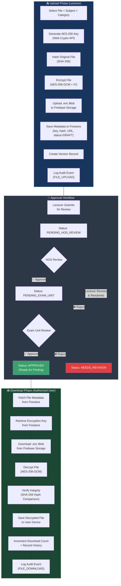
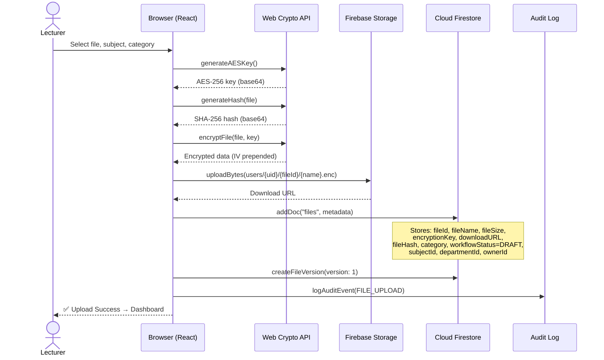
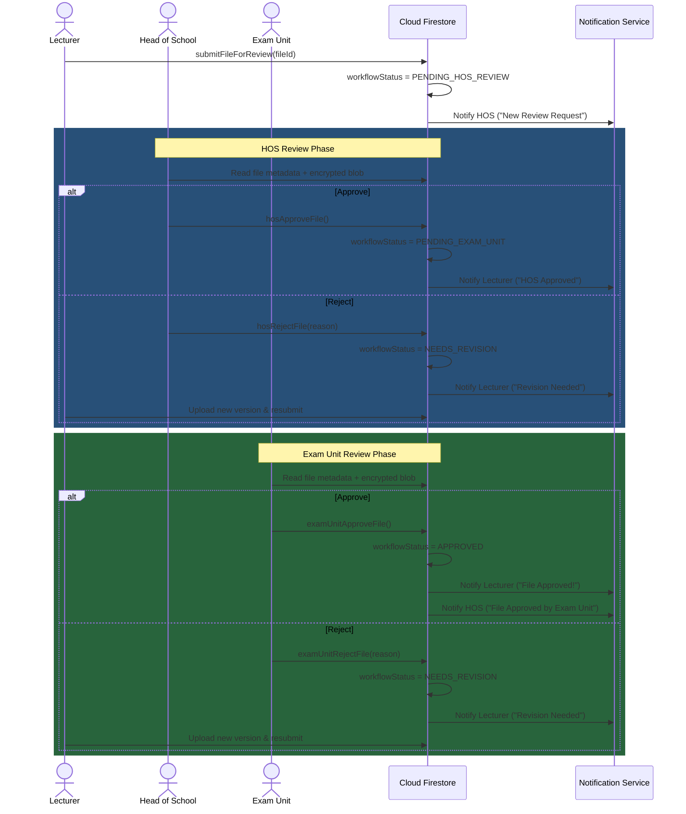
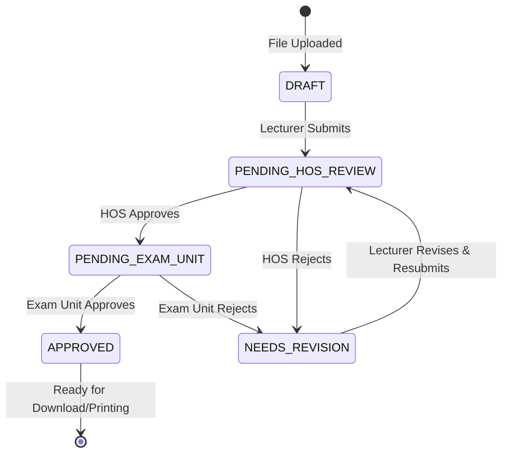
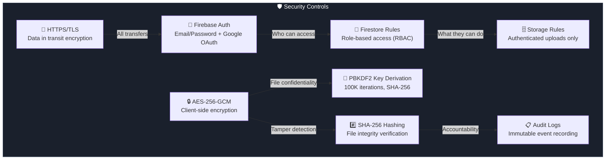

# 📁 File Transfer Diagram — KUNCHEE Exam Paper Management System

> Complete file lifecycle from upload to download, including encryption, approval workflow, and integrity verification.
>
> *Generated: 2026-03-02*

---

## 1. End-to-End File Transfer Overview

---

## 2. Detailed Upload Flow

---

## 3. Approval Workflow Detail

---

## 4. Detailed Download Flow

```mermaid
sequenceDiagram
    actor U as Authorized User
    participant B as Browser (React)
    participant FD as Cloud Firestore
    participant FS as Firebase Storage
    participant WC as Web Crypto API
    participant AL as Audit Log

    U->>B: Open ViewFile page (fileId)
    B->>FD: getFileMetadata(fileId)
    FD-->>B: File metadata (URL, key, hash, fileName)

    U->>B: Click "Download"
    B->>FS: fetch(downloadURL + alt=media)
    FS-->>B: Encrypted .enc blob (Uint8Array)

    B->>WC: decryptFile(encryptedData, key)
    Note over WC: Extract IV (first 12 bytes)<br/>Decrypt with AES-256-GCM
    WC-->>B: Decrypted Blob

    rect rgb(60, 80, 40)
        Note over B,WC: Integrity Verification
        B->>WC: generateHash(decryptedData)
        WC-->>B: Download SHA-256 hash
        B->>B: Compare download hash<br/>vs stored fileHash
        alt Match ✅
            B-->>U: "File integrity verified"
        else Mismatch ⚠️
            B-->>U: "Integrity check FAILED"
        end
    end

    B->>B: downloadBlob(file, fileName)
    B-->>U: 💾 File saved to device

    B->>FD: incrementDownloads(fileId)
    B->>FD: recordDownload(fileId, email)
    B->>AL: logAuditEvent(FILE_DOWNLOAD)
```

---

## 5. Encryption & Key Management Flow

```mermaid
flowchart LR
    subgraph KEYGEN["🔑 Key Generation"]
        K1["crypto.subtle.generateKey()\nAES-GCM, 256-bit"]
        K2["Export as base64 string"]
    end

    subgraph ENCRYPT["🔒 Encryption"]
        E1["Generate random IV\n(12 bytes)"]
        E2["AES-GCM encrypt\n(file → ciphertext + auth tag)"]
        E3["Prepend IV to ciphertext"]
        E4["Output: Uint8Array\n(IV + encrypted data)"]
    end

    subgraph STORE["💾 Storage"]
        S1["Firebase Storage\nusers/{uid}/{fileId}/{name}.enc"]
        S2["Firestore files collection\nencryptionKey, fileHash, downloadURL"]
    end

    subgraph DECRYPT["🔓 Decryption"]
        DE1["Extract IV\n(first 12 bytes)"]
        DE2["Extract ciphertext\n(remaining bytes)"]
        DE3["AES-GCM decrypt\n(validates auth tag)"]
        DE4["Output: Original file\n(as Blob)"]
    end

    K1 --> K2 --> E1 --> E2 --> E3 --> E4
    E4 --> S1
    K2 --> S2
    S1 --> DE1 --> DE2 --> DE3 --> DE4
    S2 -.->|"Key retrieval"| DE3

    style KEYGEN fill:#553c9a,color:#fff
    style ENCRYPT fill:#1a365d,color:#fff
    style STORE fill:#744210,color:#fff
    style DECRYPT fill:#1a4731,color:#fff
```

---

## 6. Workflow Status State Machine

---

## 7. Data Flow Between Components

| Step | Source | Data | Destination | Protocol |
|------|--------|------|-------------|----------|
| 1 | User browser | Raw file (PDF/DOCX) | Web Crypto API | In-memory |
| 2 | Web Crypto API | AES-256 key | Firestore `files.encryptionKey` | HTTPS (TLS) |
| 3 | Web Crypto API | SHA-256 hash | Firestore `files.fileHash` | HTTPS (TLS) |
| 4 | Web Crypto API | Encrypted blob (IV + ciphertext) | Firebase Storage (`*.enc`) | HTTPS (TLS) |
| 5 | Firebase Storage | Download URL | Firestore `files.downloadURL` | HTTPS (TLS) |
| 6 | Firestore | File metadata | Reviewer browser (HOS/Exam Unit) | HTTPS (TLS) |
| 7 | Firebase Storage | Encrypted blob | Downloader browser | HTTPS (TLS) |
| 8 | Firestore | Encryption key | Web Crypto API (client) | HTTPS (TLS) |
| 9 | Web Crypto API | Decrypted file | User device (save dialog) | Local |

---

## 8. Security Controls at Each Transfer Point

---

*This diagram reflects the current implementation as of 2026-03-02. Update when the system architecture changes.*
