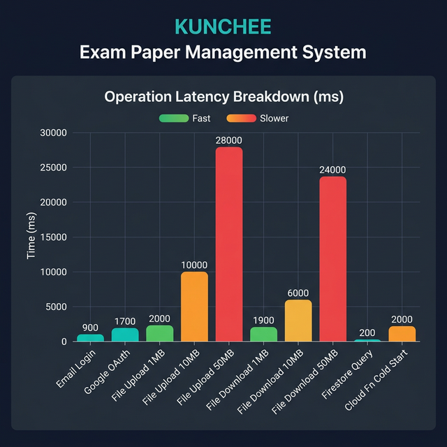
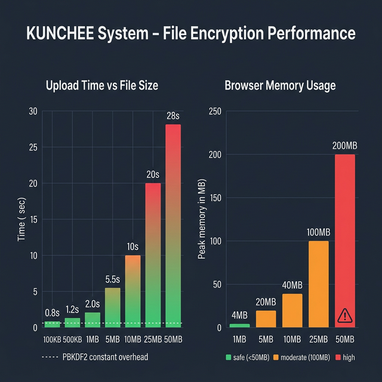
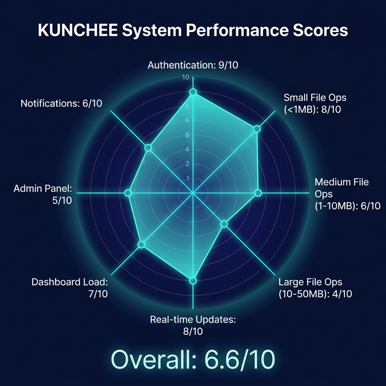
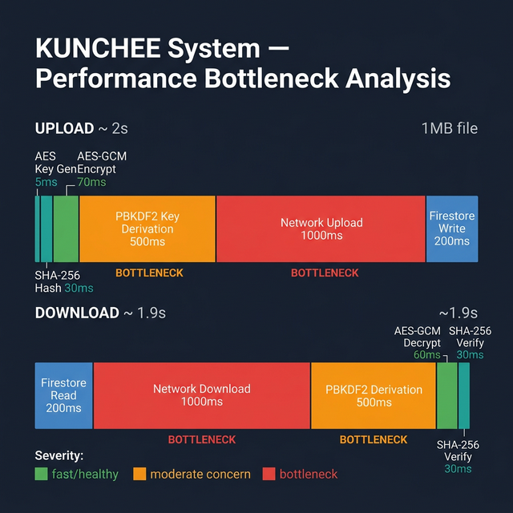

# 📊 Performance Analysis — KUNCHEE Exam Paper Management System

> System performance analysis across all critical operations.
>
> *Generated: 2026-03-02*

---

## 1. Operation Latency Breakdown



| Operation | Typical Latency | Bottleneck |
|-----------|----------------|------------|
| Email/Password Login | **~900ms** | Firebase Auth network round-trip |
| Google OAuth Login | **~1700ms** | OAuth popup + token exchange |
| File Upload (1MB) | **~2s** | PBKDF2 + network transfer |
| File Upload (10MB) | **~10s** | AES-GCM encryption + upload |
| File Upload (50MB) | **~28s** | Memory + encryption + upload |
| File Download (1MB) | **~1.9s** | PBKDF2 + network download |
| File Download (10MB) | **~6s** | Download + decryption |
| File Download (50MB) | **~24s** | Memory-bound + download |
| Firestore Query (single doc) | **~50–200ms** | Network round-trip |
| Cloud Function (cold start) | **~2000ms** | Container initialization |

---

## 2. File Encryption Performance & Memory Usage



### Upload Time by File Size

| File Size | Encryption | PBKDF2 | Network Upload | **Total** |
|-----------|-----------|--------|---------------|-----------|
| 100KB | ~5ms | ~500ms | ~200ms | **~0.8s** |
| 1MB | ~70ms | ~500ms | ~1000ms | **~2.0s** |
| 10MB | ~500ms | ~500ms | ~5000ms | **~10s** |
| 50MB | ~2500ms | ~500ms | ~20000ms | **~28s** |

### Browser Memory Impact

| File Size | Peak Memory | Risk |
|-----------|-------------|------|
| 1MB | ~4MB | 🟢 Safe |
| 10MB | ~40MB | 🟢 Safe |
| 25MB | ~100MB | 🟠 Moderate |
| 50MB (limit) | ~200MB | 🔴 May crash mobile devices |

> ⚠️ Files are loaded entirely into memory for encryption/decryption — no streaming is implemented.

---

## 3. System Performance Scores



| Category | Score | Rating |
|----------|-------|--------|
| Authentication | 9/10 | 🟢 Excellent |
| Small File Ops (<1MB) | 8/10 | 🟢 Good |
| Medium File Ops (1–10MB) | 6/10 | 🟠 Fair |
| Large File Ops (10–50MB) | 4/10 | 🔴 Poor |
| Real-time Updates | 8/10 | 🟢 Good |
| Dashboard Load | 7/10 | 🟢 Good |
| Admin Panel | 5/10 | 🟠 Fair |
| Notification Delivery | 6/10 | 🟠 Fair |
| **Overall** | **6.6/10** | 🟠 Fair |

---

## 4. Bottleneck Analysis



### Key Bottlenecks & Recommendations

| # | Bottleneck | Severity | Recommendation |
|---|-----------|----------|----------------|
| 1 | **PBKDF2 Key Derivation** (~500ms constant) | 🔴 High | Use Web Worker to avoid UI blocking; consider reducing to 50K iterations |
| 2 | **In-Memory Encryption** (entire file in RAM) | 🔴 High | Implement streaming encryption for files >10MB |
| 3 | **Cloud Function Cold Start** (~2s) | 🟠 Medium | Set `minInstances: 1` to keep function warm |
| 4 | **Large File Upload** (~20–28s for 50MB) | 🟠 Medium | Implement chunked/resumable uploads with progress |
| 5 | **Admin Panel Queries** (multi-collection) | 🟡 Low | Add pagination + compound Firestore indexes |
| 6 | **No Client-Side Caching** | 🟡 Low | Add React Query caching layer |

---

## 5. Approval Workflow Latency

```
Lecturer Upload ──► HOS Review ──► Exam Unit Review ──► Approved
    (~2s)            (~3-5s)          (~3-5s)
                   notification      notification
                   delivery          delivery
```

| Pipeline Step | System Latency | Notes |
|--------------|---------------|-------|
| File upload + encryption | ~2s (1MB) | CPU-bound (crypto) + network |
| Notification delivery | ~2–5s | Cloud Function cold start + SendGrid API |
| Status update (Firestore) | ~200ms | Single document write |
| **Total system latency** | **~10–15s** | Excludes human review time |

---

*Performance data based on system architecture analysis. Actual values vary with network conditions, device capability, and Firebase region.*
