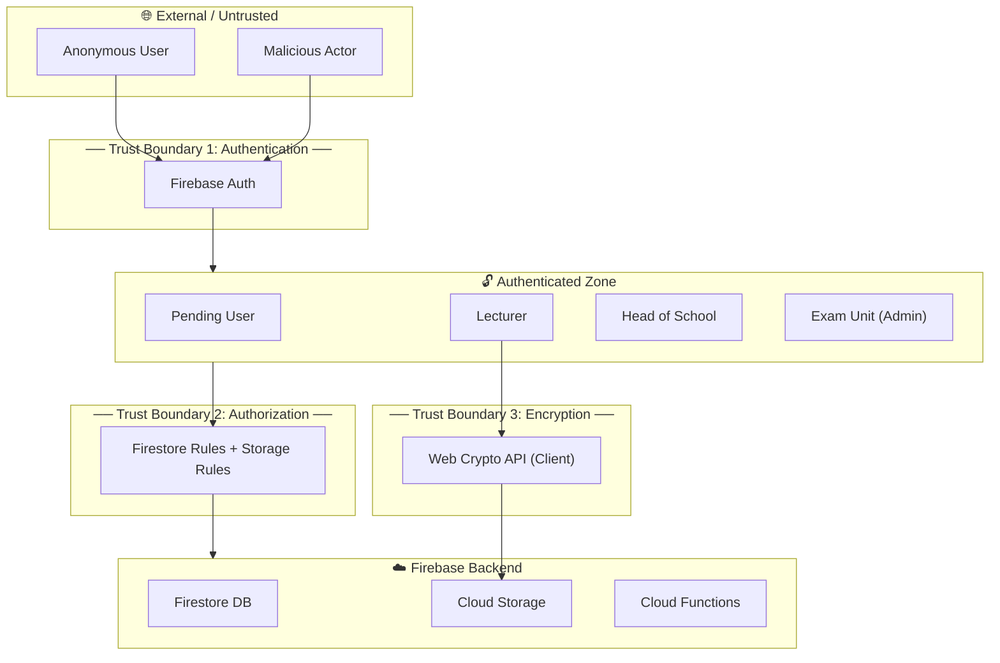
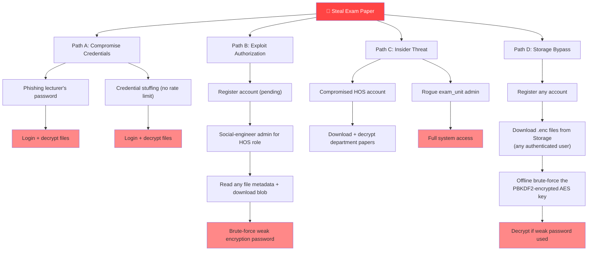

# 🛡️ Threat Model — Exam Paper Management System (KUNCHEE)

> Based on analysis of the deployed system architecture, security rules, encryption service, authentication flow, and role-based access control.
>
> *Generated: 2026-03-02*

---

## 1. System Overview

The system is a **University Exam Paper Management System** built with:

| Layer | Technology |
|-------|-----------|
| Frontend | React + Vite + TailwindCSS (SPA) |
| Hosting | Firebase Hosting |
| Authentication | Firebase Auth (Email/Password + Google OAuth) |
| Database | Cloud Firestore |
| File Storage | Firebase Cloud Storage |
| Encryption | Client-side AES-256-GCM (Web Crypto API) |
| Key Derivation | PBKDF2 (100K iterations, SHA-256) |
| Integrity | SHA-256 file hashing |
| Cloud Functions | SendGrid email notifications |

### Data Flow Summary

```
Lecturer → [Encrypt file client-side] → Firebase Storage (.enc)
                                       → Firestore (metadata + encrypted key)
         → HOS reviews & approves     → Exam Unit final approval
         → Authorized user downloads   → [Decrypt client-side] → Original file
```

---

## 2. Trust Boundaries



| Boundary | Description | Controls |
|----------|-------------|----------|
| **TB1 — Authentication** | Separates anonymous from authenticated users | Firebase Auth (email/password, Google OAuth) |
| **TB2 — Authorization** | Separates roles and data access | Firestore Rules, Storage Rules, frontend route guards |
| **TB3 — Encryption** | Protects file confidentiality even if storage is compromised | AES-256-GCM, PBKDF2 key derivation, SHA-256 hashing |

---

## 3. Threat Actors

| Actor | Capability | Motivation |
|-------|-----------|------------|
| **External attacker** | No credentials, probes public endpoints | Steal exam papers for cheating/sale |
| **Malicious student** | May register an account (gets `pending` role) | Access exam papers before exams |
| **Compromised lecturer** | Valid credentials, `lecturer` role | Leak or tamper with exam papers |
| **Insider (rogue admin)** | `exam_unit` role with full access | Data exfiltration or sabotage |
| **Man-in-the-Middle** | Network interception capability | Intercept credentials or encrypted files |
| **Cloud provider breach** | Access to Firebase backend data | Mass data exfiltration |

---

## 4. STRIDE Threat Analysis

### 4.1 Spoofing (Identity)

| # | Threat | Attack Vector | Severity | Current Mitigation | Gap |
|---|--------|--------------|----------|-------------------|-----|
| S1 | **Credential stuffing** | Automated login attempts with leaked passwords | 🔴 High | Firebase Auth brute-force protection | No rate limiting / App Check configured |
| S2 | **Phishing for passwords** | Fake login page harvests credentials | 🔴 High | None | No 2FA/MFA implemented |
| S3 | **Session hijacking** | Steal Firebase auth token from browser | 🟠 Medium | HTTPS, short-lived tokens | Tokens stored in localStorage/sessionStorage |
| S4 | **Account takeover via password reset** | Attacker triggers password reset for victim | 🟡 Low | Firebase handles reset flow | Email verification not enforced |
| S5 | **Google OAuth token misuse** | Compromised Google account used to login | 🟠 Medium | Google's own security | No additional verification after OAuth |

---

### 4.2 Tampering (Data Integrity)

| # | Threat | Attack Vector | Severity | Current Mitigation | Gap |
|---|--------|--------------|----------|-------------------|-----|
| T1 | **File tampering in storage** | Modify encrypted blob in Firebase Storage | 🟡 Low | AES-GCM auth tag detects tampering; SHA-256 hash verification | ✅ Well-mitigated |
| T2 | **Metadata tampering** | Modify file status (e.g., set to `APPROVED`) via direct Firestore API | 🟠 Medium | Firestore rules restrict updates by role | HOS can update *any* file (`isHOS()` allows broad update) |
| T3 | **Role self-promotion** | User tries to change own role to `exam_unit` | 🟡 Low | Firestore rule blocks role field changes by self | ✅ Well-mitigated |
| T4 | **Audit log tampering** | Delete or modify audit log entries | 🟢 Minimal | `allow update, delete: if false` rule | ✅ Immutable audit logs |
| T5 | **Notification spoofing** | Any authenticated user can create notifications | 🟠 Medium | `allow create: if isAuthenticated()` | Any user can spam fake notifications to others |
| T6 | **Download count manipulation** | Non-atomic increment of download counter | 🟡 Low | Read-then-write pattern | Race condition possible; not security-critical |

---

### 4.3 Repudiation (Deniability)

| # | Threat | Attack Vector | Severity | Current Mitigation | Gap |
|---|--------|--------------|----------|-------------------|-----|
| R1 | **Deny file upload** | Lecturer uploads malicious paper, denies it | 🟠 Medium | `createdBy` field set on upload; audit logs | Audit logs only recently added |
| R2 | **Deny approval** | HOS approves leaked paper, denies approving | 🟠 Medium | Audit logs record actions | No digital signatures on approvals |
| R3 | **Deny download** | User downloads and leaks paper, denies it | 🟠 Medium | Download history tracking | Download history stored in file doc (owner can see, but manipulation possible) |
| R4 | **HOS denies modifying file** | HOS broadly permitted to update any file | 🟠 Medium | Audit log `create` is allowed | No field-level restriction on what HOS can change |

---

### 4.4 Information Disclosure (Confidentiality)

| # | Threat | Attack Vector | Severity | Current Mitigation | Gap |
|---|--------|--------------|----------|-------------------|-----|
| I1 | **Encrypted file download by any user** | Any authenticated user can download `.enc` files from Storage | 🟡 Low | Files are AES-256-GCM encrypted; key access restricted by Firestore rules | Relies entirely on encryption — defense-in-depth could be stronger |
| I2 | **Encryption key in Firestore** | `encryptedKey` + `salt` stored in Firestore metadata | 🟠 Medium | Key encrypted with PBKDF2 (100K iterations) using user password | If weak password is used, key is brute-forceable |
| I3 | **Firebase config exposed in client** | API keys, project ID visible in source code | 🟡 Low | Firebase API keys are not secret (design intent); Firestore rules protect data | No App Check to prevent API abuse |
| I4 | **Error messages leak info** | Stack traces or Firestore paths in console | 🟡 Low | `console.error` used throughout | Error details available in browser DevTools |
| I5 | **Legacy fixed-salt encryption** | `encryptText()` uses hardcoded salt | 🔴 High | Deprecated; `encryptTextWithSalt()` exists | Legacy function still in codebase; unclear if old files use it |
| I6 | **Encryption key in share URLs** | Key visible in browser history / server logs | 🟠 Medium | Flagged in SYSTEM_GAPS | Not resolved |
| I7 | **HOS reads all files** | `isHOS()` grants read on all files, not just own department | 🟠 Medium | Role check only | No department-scoping on HOS read access |
| I8 | **Lecturers can read all user profiles** | `allow read: if isLecturer()` on users collection | 🟡 Low | Needed for collaboration features | Exposes emails of all users in system |

---

### 4.5 Denial of Service (Availability)

| # | Threat | Attack Vector | Severity | Current Mitigation | Gap |
|---|--------|--------------|----------|-------------------|-----|
| D1 | **Storage abuse** | Attacker uploads many 50MB files to exhaust quota | 🟠 Medium | 50MB per-file limit | No per-user upload quota or rate limiting |
| D2 | **Firestore quota exhaustion** | Automated reads/writes to exhaust free tier | 🟠 Medium | None | No Firebase App Check configured |
| D3 | **Notification spam** | Any authenticated user can flood notifications | 🟡 Low | None | No rate limit on notification creation |
| D4 | **Large file crashes browser** | Files fully loaded into memory for encryption/decryption | 🟠 Medium | None | No streaming encryption for large files |
| D5 | **Registration spam** | Mass account creation with throwaway emails | 🟡 Low | Accounts start as `pending` | No CAPTCHA on registration |

---

### 4.6 Elevation of Privilege

| # | Threat | Attack Vector | Severity | Current Mitigation | Gap |
|---|--------|--------------|----------|-------------------|-----|
| E1 | **Self-role-promotion** | Modify own `role` field via Firestore SDK | 🟢 Minimal | Firestore rule blocks self role change | ✅ Well-mitigated |
| E2 | **HOS updates any user** | `allow update: if isHOS()` — no field restrictions | 🔴 High | Rule allows update | HOS could change *another user's role* to `exam_unit` |
| E3 | **Pending user access** | Bypass frontend route guard, call Firestore directly | 🟡 Low | Firestore rules check role server-side | Pending users can still read departments and create notifications |
| E4 | **Frontend-only route guards** | Modify React code in browser to bypass guards | 🟡 Low | Firestore rules enforce authorization server-side | ✅ Backend rules are the real enforcement |
| E5 | **Orphaned Auth account** | Firestore user deleted but Firebase Auth account persists | 🟠 Medium | Noted in codebase | Deleted user could re-create Firestore doc with `pending` role |

---

## 5. Critical Risk Summary

| Risk | STRIDE | Severity | Status |
|------|--------|----------|--------|
| **HOS can escalate any user's role** (E2) | Elevation of Privilege | 🔴 Critical | ⚠️ Unmitigated |
| **Legacy fixed-salt PBKDF2** (I5) | Information Disclosure | 🔴 High | ⚠️ Deprecated but code remains |
| **No MFA / 2FA** (S2) | Spoofing | 🔴 High | ❌ Not implemented |
| **No rate limiting / App Check** (S1, D1, D2) | Spoofing / DoS | 🔴 High | ❌ Not configured |
| **HOS has unrestricted file read access** (I7) | Information Disclosure | 🟠 Medium | ⚠️ No department scoping |
| **Notification creation open to all** (T5, D3) | Tampering / DoS | 🟠 Medium | ⚠️ No restrictions |
| **Encryption key in share URLs** (I6) | Information Disclosure | 🟠 Medium | ⚠️ Known but unresolved |
| **No email verification enforced** (S4) | Spoofing | 🟠 Medium | ⚠️ Optional |

---

## 6. Recommended Mitigations (Priority Order)

### 🔴 Critical — Fix Immediately

| # | Mitigation | Addresses |
|---|-----------|-----------|
| 1 | **Restrict HOS update rule** — Add field-level restrictions so HOS cannot modify `role`, only `status`, `feedback` fields on files | E2 |
| 2 | **Remove or isolate legacy `encryptText()`** — Ensure no code paths use the fixed-salt version | I5 |
| 3 | **Enable Firebase App Check** — Prevents API abuse from unofficial clients | S1, D1, D2 |

### 🟠 High — Fix Before Production

| # | Mitigation | Addresses |
|---|-----------|-----------|
| 4 | **Implement MFA/2FA** for `exam_unit` and `hos` roles at minimum | S2 |
| 5 | **Scope HOS file access to their department** — Add `resource.data.department == getUserDepartment()` check | I7 |
| 6 | **Restrict notification creation** — Only allow system roles or file participants to create notifications | T5, D3 |
| 7 | **Enforce email verification** before allowing role approval | S4 |
| 8 | **Implement CAPTCHA** on registration page | D5 |

### 🟡 Medium — Improve Over Time

| # | Mitigation | Addresses |
|---|-----------|-----------|
| 9 | **Add Content Security Policy (CSP) headers** via Firebase Hosting config | I4, General |
| 10 | **Implement streaming encryption** for files >10MB | D4 |
| 11 | **Remove encryption keys from share URLs** — Use an intermediate key-exchange mechanism | I6 |
| 12 | **Add digital signatures to approval actions** for non-repudiation | R2, R4 |
| 13 | **Reduce user profile visibility for lecturers** — Return only necessary fields | I8 |

---

## 7. Attack Tree — Exam Paper Theft



---

## 8. Data Classification

| Data | Classification | Storage | Protection |
|------|---------------|---------|-----------|
| Exam papers (files) | **🔴 Highly Confidential** | Firebase Storage (.enc) | AES-256-GCM + password-protected key |
| Encryption keys | **🔴 Highly Confidential** | Firestore (encrypted) | PBKDF2 (100K iterations) + unique salt |
| User passwords | **🔴 Highly Confidential** | Firebase Auth | Firebase managed (bcrypt/scrypt) |
| User profiles (name, email, role) | **🟠 Internal** | Firestore | Firestore rules (readable by all authenticated) |
| File metadata (status, department) | **🟠 Internal** | Firestore | Role-based Firestore rules |
| Audit logs | **🟡 Operational** | Firestore | Immutable (no update/delete) |
| Notifications | **🟢 Low** | Firestore | User-scoped read |

---

## 9. Compliance Considerations

| Requirement | Status | Notes |
|------------|--------|-------|
| **Data at rest encryption** | ✅ Implemented | AES-256-GCM client-side encryption |
| **Data in transit encryption** | ✅ Implemented | HTTPS (Firebase Hosting enforces TLS) |
| **Access control** | ✅ Implemented | RBAC with 4 roles, Firestore rules |
| **Audit trail** | ⚠️ Partial | Audit logs collection added; immutable |
| **Data integrity** | ✅ Implemented | SHA-256 hash verification on download |
| **Password policy** | ✅ Implemented | Min 8 chars, uppercase, number, special character |
| **Two-factor auth** | ❌ Missing | Not implemented |
| **Data retention policy** | ❌ Missing | No automatic file expiration enforcement |
| **Incident response plan** | ❌ Missing | Not documented |
| **Backup & recovery** | ❌ Missing | No backup strategy |

---

*This threat model should be reviewed and updated whenever the system architecture or security controls change.*
