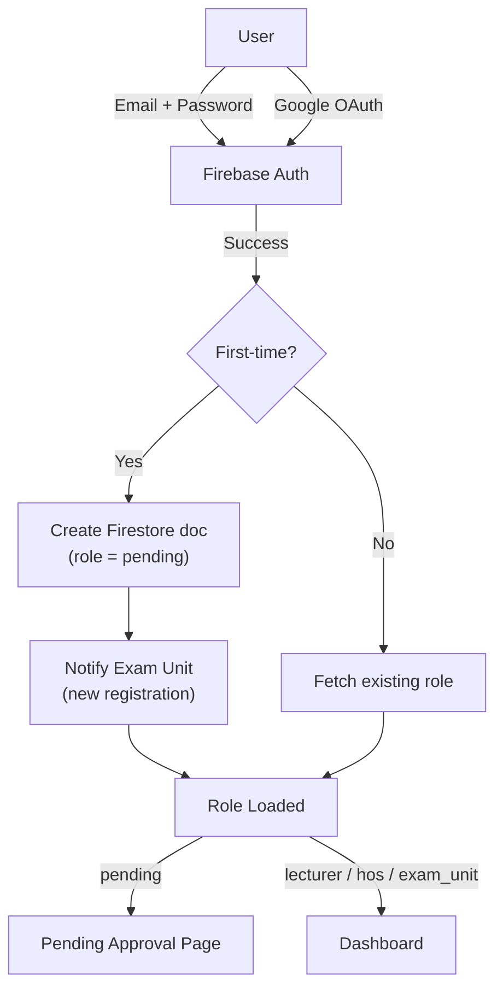
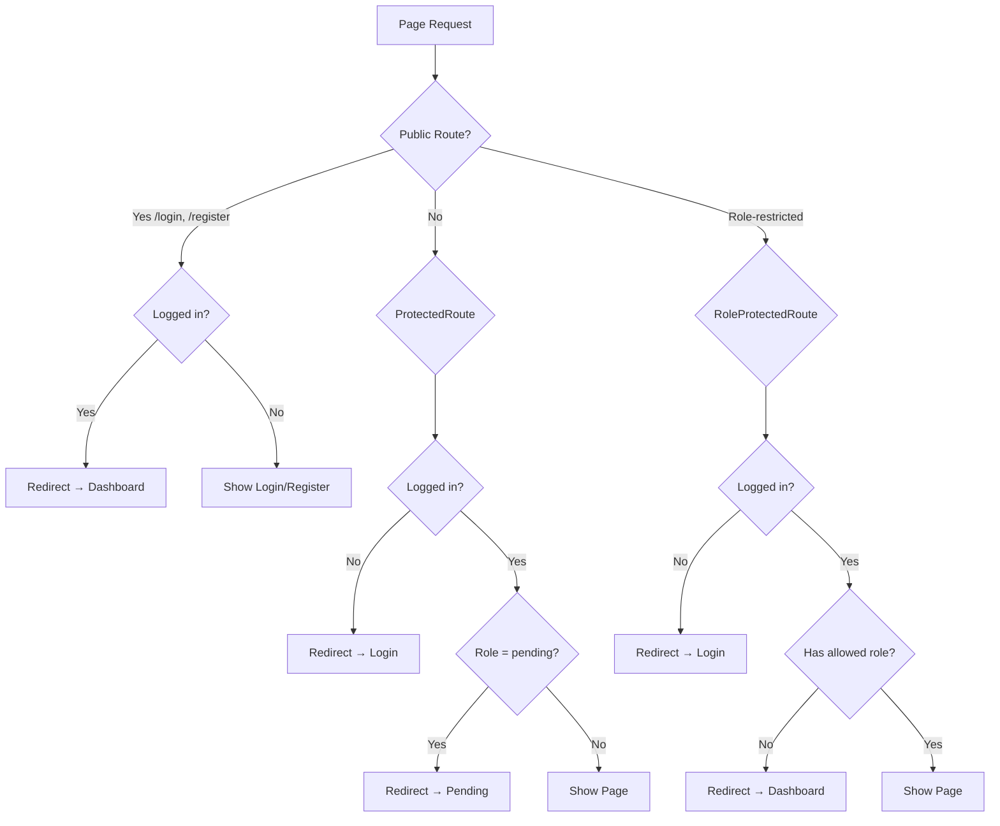
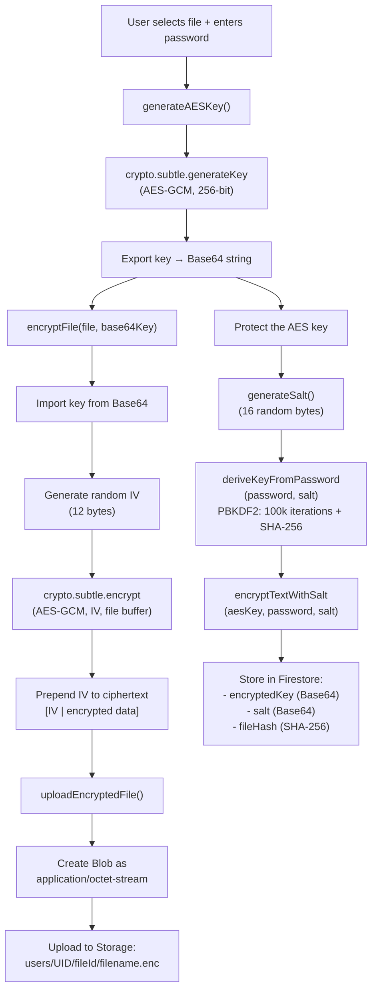
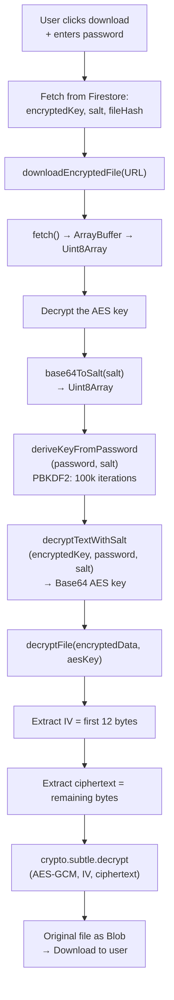
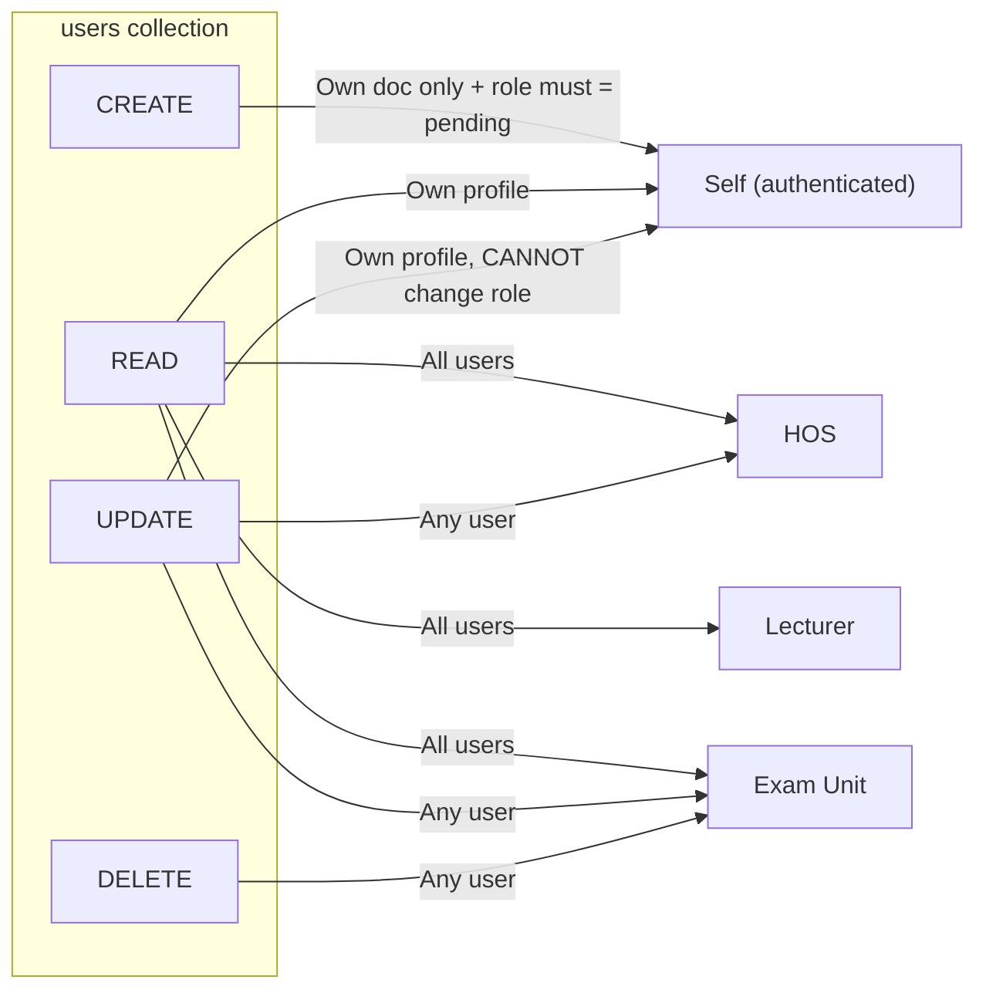
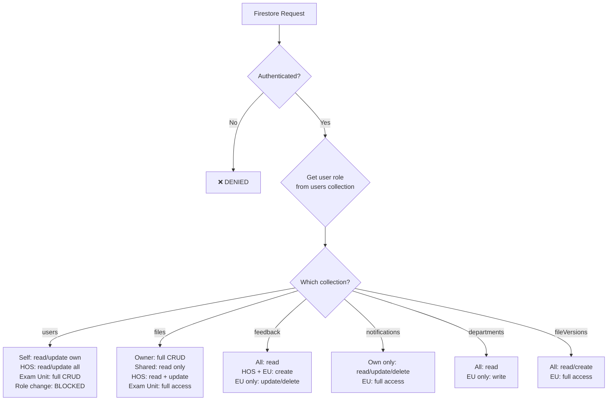
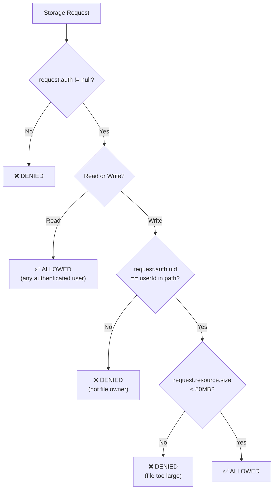
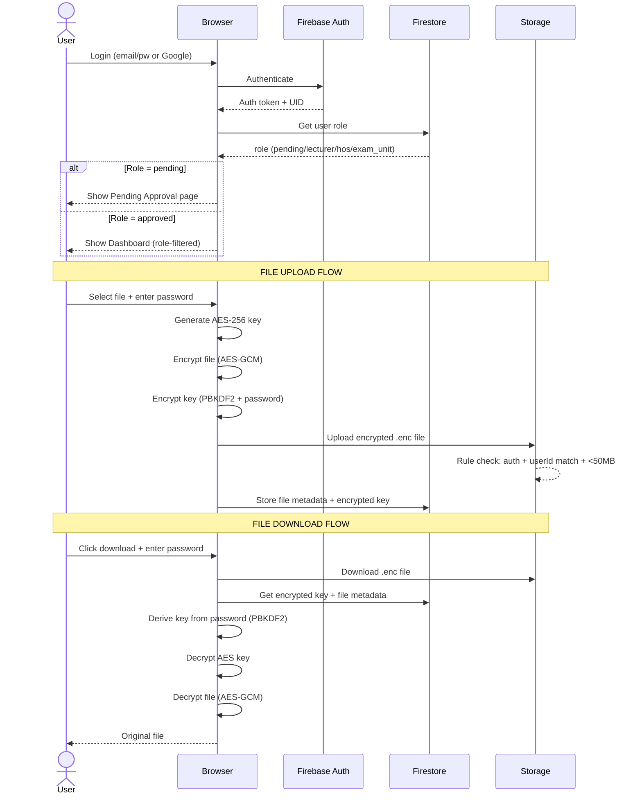

# FileShare Security Flow Overview

> For diagram sketching — all layers of the system's security architecture.

---

## 1. Authentication Layer (Firebase Auth)



**Methods:**
- Email / Password registration & login
- Google Sign-In (OAuth popup)
- Password reset via email

---

## 2. Role-Based Access Control (RBAC)

### Roles hierarchy (4 levels):

| Role | Description | Can Access |
|------|-------------|------------|
| `pending` | Newly registered, awaiting approval | `/pending` only |
| `lecturer` | Approved teacher | Dashboard, Upload, Settings, View Files |
| `hos` | Head of School | All lecturer pages + HOS Review |
| `exam_unit` | Super admin | Everything + Admin Panel + Exam Review |

### Self-promotion protection:
- Users **cannot** change their own `role` field (Firestore rule blocks it)
- Only `exam_unit` can promote users

---

## 3. Frontend Route Guards (3 layers)



### Route → Guard mapping:

| Route | Guard | Allowed Roles |
|-------|-------|---------------|
| `/login`, `/register` | `PublicRoute` | Unauthenticated only |
| `/dashboard`, `/upload`, `/settings` | `ProtectedRoute` | Any approved role |
| `/admin` | `RoleProtectedRoute` | `exam_unit` |
| `/hos-review` | `RoleProtectedRoute` | `hos`, `exam_unit` |
| `/exam-review` | `RoleProtectedRoute` | `exam_unit` |
| `/file`, `/view/:fileId` | None (public) | Anyone with link + key |

---

## 4. End-to-End File Encryption (Detailed)

### 4.1 Cryptographic Parameters

| Parameter | Value | Source |
|-----------|-------|--------|
| **Algorithm** | AES-GCM | `constants.js` → `ENCRYPTION_ALGORITHM.name` |
| **Key length** | 256-bit | `constants.js` → `ENCRYPTION_ALGORITHM.length` |
| **IV length** | 12 bytes (96-bit) | `constants.js` → `ENCRYPTION_ALGORITHM.ivLength` |
| **Key derivation** | PBKDF2 | `encryptionService.js` → `deriveKeyFromPassword()` |
| **PBKDF2 iterations** | 100,000 | Hardcoded in `deriveKeyFromPassword()` |
| **PBKDF2 hash** | SHA-256 | Hardcoded in `deriveKeyFromPassword()` |
| **Salt** | 16 bytes, random per file | `generateSalt()` → `crypto.getRandomValues(new Uint8Array(16))` |
| **Integrity hash** | SHA-256 | `generateHash()` → `crypto.subtle.digest('SHA-256', data)` |
| **API** | Web Crypto API | `window.crypto.subtle` (requires HTTPS) |

### 4.2 Upload Encryption Flow (Step-by-Step)



### 4.3 Download Decryption Flow (Step-by-Step)



### 4.4 Data Format on Disk

```
Encrypted file blob structure:
┌──────────────┬─────────────────────────────┐
│  IV (12 B)   │     AES-GCM Ciphertext      │
└──────────────┴─────────────────────────────┘

Firestore file document stores:
├── encryptedKey   (Base64 string — AES key encrypted with PBKDF2-derived key)
├── salt           (Base64 string — 16-byte random salt)
├── fileHash       (Base64 string — SHA-256 of original file)
├── createdBy      (UID of uploader)
└── sharedWith     (array of email addresses)
```

### 4.5 Key Security Properties

- **Zero-knowledge**: The server (Firebase) never sees the plaintext file or the AES key
- **Password-protected keys**: Even if Firestore is breached, keys are encrypted with PBKDF2 (100k iterations)
- **Unique salt per file**: Prevents rainbow table attacks on the key encryption
- **Random IV per encryption**: Prevents pattern detection across encrypted files
- **AES-GCM authentication tag**: Detects any tampering with the ciphertext
- **SHA-256 integrity**: Verifies the decrypted file matches the original

---

## 5. Firestore Security Rules (Detailed)

### 5.1 Helper Functions

```
isAuthenticated()    → request.auth != null
getUserRole()        → reads users/{uid}.role from Firestore
isExamUnit()         → authenticated + role == 'exam_unit'
isHOS()              → authenticated + role == 'hos'
isLecturer()         → authenticated + role == 'lecturer'
isOwner(ownerId)     → authenticated + auth.uid == ownerId
hasSharedAccess(arr) → authenticated + auth.email in sharedWith[]
```

### 5.2 Per-Collection Access Matrix

#### `users/{userId}` — User profiles



| Operation | Self | Lecturer | HOS | Exam Unit |
|-----------|------|----------|-----|-----------|
| **Create** | ✅ (role must = `pending`) | — | — | — |
| **Read own** | ✅ | ✅ | ✅ | ✅ |
| **Read others** | ❌ | ✅ | ✅ | ✅ |
| **Update own** | ✅ (cannot change `role`) | ✅ (cannot change `role`) | ✅ | ✅ |
| **Update others** | ❌ | ❌ | ✅ | ✅ |
| **Delete** | ❌ | ❌ | ❌ | ✅ |

> **Anti-privilege-escalation**: `!request.resource.data.diff(resource.data).affectedKeys().hasAny(['role'])` — blocks users from modifying their own role.

#### `files/{fileId}` — Encrypted file metadata

| Operation | Owner | Shared User | HOS | Exam Unit |
|-----------|-------|-------------|-----|-----------|
| **Create** | ✅ (`createdBy` must = UID) | ❌ | ❌ | ✅ |
| **Read** | ✅ | ✅ (email in `sharedWith[]`) | ✅ | ✅ |
| **Update** | ✅ | ❌ | ✅ (for approval/rejection) | ✅ |
| **Delete** | ✅ | ❌ | ❌ | ✅ |

#### `fileVersions/{versionId}` — Version history

| Operation | Any Authenticated | Exam Unit |
|-----------|-------------------|-----------|
| **Read** | ✅ | ✅ |
| **Create** | ✅ | ✅ |
| **Update / Delete** | ❌ | ✅ |

#### `feedback/{feedbackId}` — Review feedback

| Operation | Lecturer | HOS | Exam Unit |
|-----------|----------|-----|-----------|
| **Read** | ✅ | ✅ | ✅ |
| **Create** | ❌ | ✅ | ✅ |
| **Update / Delete** | ❌ | ❌ | ✅ |

#### `notifications/{notificationId}` — User notifications

| Operation | Own Notification | Others' Notifications | Exam Unit |
|-----------|-----------------|----------------------|-----------|
| **Read** | ✅ | ❌ | ✅ |
| **Create** | ✅ (any authenticated) | ✅ | ✅ |
| **Update** | ✅ (mark as read) | ❌ | ✅ |
| **Delete** | ✅ | ❌ | ✅ |

#### `departments/{deptId}` — Department data

| Operation | Any Authenticated | Exam Unit |
|-----------|-------------------|-----------|
| **Read** | ✅ | ✅ |
| **Write** | ❌ | ✅ |

### 5.3 Overall Rules Diagram



---

## 6. Firebase Storage Rules (Detailed)

### 6.1 Storage Path Structure

```
Firebase Storage
└── users/
    └── {userId}/                    ← Owner's UID (auth.uid must match for write)
        └── {fileId}/               ← Unique file identifier
            └── {filename}.enc      ← Encrypted file blob (AES-GCM)
```

### 6.2 Rules Breakdown



### 6.3 Rules Matrix

| Action | Condition | Purpose |
|--------|-----------|---------|
| **Read** | `request.auth != null` | Any logged-in user can download (file is encrypted anyway) |
| **Write** | `request.auth != null` | Must be logged in |
| **Write** | `request.auth.uid == userId` | Can only upload to your own folder |
| **Write** | `request.resource.size < 50MB` | Hard size limit per file |

### 6.4 Why Read Access Is Broad

> [!IMPORTANT]
> Storage read access is granted to **all authenticated users** — this is intentional, not a vulnerability:
>
> 1. **Files are AES-256-GCM encrypted** — the `.enc` blob is meaningless without the decryption key
> 2. **The decryption key is stored encrypted in Firestore** — protected by PBKDF2 + user password
> 3. **Firestore rules restrict file metadata access** — only owner, shared users, HOS, or Exam Unit can read the `files` document containing the encrypted key
> 4. **Defense in depth** — even if someone downloads the `.enc` file, they need: the encrypted AES key (from Firestore) + the user's password + the salt → to derive the PBKDF2 key → to decrypt the AES key → to decrypt the file

---

## 7. Full Security Flow (End-to-End)



---

## Summary Table for Diagram

| Security Layer | Technology | Purpose |
|----------------|------------|---------|
| Authentication | Firebase Auth | Email/Password + Google OAuth |
| Authorization (frontend) | React Route Guards | 3 guard types: Public, Protected, RoleProtected |
| Authorization (backend) | Firestore Rules | Per-collection RBAC with role helper functions |
| Storage access | Storage Rules | Owner-write, auth-read, 50MB size limit |
| Data encryption | Web Crypto API | AES-256-GCM file encryption, PBKDF2 key derivation |
| Key management | Client-side | Encrypted with user password, stored in Firestore |
| Role management | Firestore `users` collection | 4 roles: pending → lecturer → hos → exam_unit |
| Anti-privilege-escalation | Firestore rules | Users cannot modify their own `role` field |
